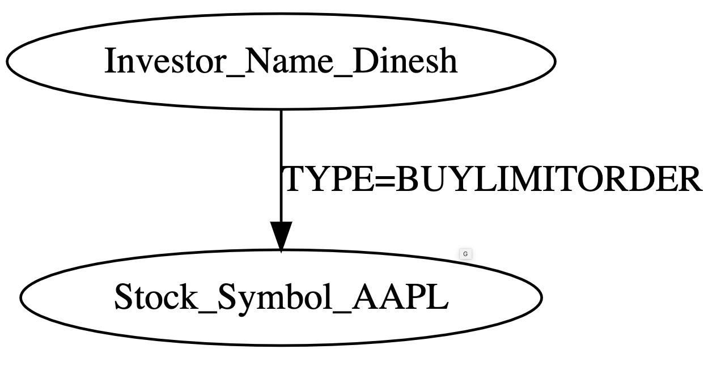

# Project Scope

### High Level
We are creating a re-usable plugin for testing software that manipulates Neo4J graphs.

The plugin will be published on the internet for others to use.

The plugin will accept graph test cases specified by the user as [dot language](https://dreampuf.github.io/GraphvizOnline/#digraph%20G%20%7B%0A%20%20Investor_Name_Dinesh%5B%5D%3B%0A%20%20Stock_Symbol_AAPL%5B%5D%3B%0A%20%20Investor_Name_Dinesh%20-%3E%20Stock_Symbol_AAPL%3B%0A%7D).

For example, given the following [graph](https://dreampuf.github.io/GraphvizOnline/#digraph%20G%20%7B%0A%20%20Investor_Name_Dinesh%5B%5D%3B%0A%20%20Stock_Symbol_AAPL%5B%5D%3B%0A%20%20Investor_Name_Dinesh%20-%3E%20Stock_Symbol_AAPL%20%5B%20label%3D%22TYPE%3DBUYLIMITORDER%22%20%5D%3B%0A%7D):

The plugin will understand that we need 2 nodes where one is an `Investor` type and the `Name=Dinesh` &amp; a `Stock` node with `Symbol=AAPL` as well as an edge with the type as `BUYLIMITORDER` going between the two nodes.

The plugin will connect to an existing Neo4J database instance and manipulate the graph into the format described by the user.

The plugin will generating the necessary [cypher query statements](https://neo4j.com/developer/cypher/updating/) to transfer the input graphs onto the database.

### Metrics

The plugin will track whatever metrics the user is interested in during the test. We provide implementations for the following simple metrics:

  - Counts of a specific type of node (ie. how many investors are in the graph)
  - Counts of a specific type of edge (ie. how many `BUY LIMIT ORDER` orders are in the graph)
  - How many nodes have changes in the graph since the last time we checked? (ie. how many stocks have had their price updated during the program's running)

For example, consider the following graph:

> Figure 2: Example graph here showing one investor and one stock with two order edges between the nodes.

If we were to measure the above metrics on the graph we would see:

|metric|value on example graph|
|---|---|
|How many investors are in the graph| 1|
|How many `BUY LIMIT ORDER` orders are in the graph|1|
|How many stocks have had their price updated during the program's running|Since we don't have another graph to compare to we don't know, if this is the first measurement then it would be 1 given an empty graph or 0 if this is how the graph started.|

The plugin will measure the metrics at the rate specified by the user in milliseconds. The user will expect the values to either go up or down over the course of the test and the test will fail or pass depending on if graph behaves in the way the user expects.

### Test execution time

Tests can be configured to be run for a specified length of time to test long-running programs, or for the duration of a program's execution for programs that do not run indefinitely.

The method that is being tested will be run in a separate thread, so that we can continue to measure the metrics at the appripriate time in the main thread.

### Generating additional test cases

The plugin will enable new test case generation from the user input. 

These are intended to catch edge cases that programs do not account for, such as checking price for a stock whose price is unavailible.

Assuming a graph similar to Figure 1 the supported graph perturbation methods are in the table below:

|perturbation methods|description|figure depiction|
|---|---|---|
|DEFAULT|This method uses exactly the same graph that was input from the user| 1|
|DUPLICATE|This method uses the same graph and adds `Copy` to the identifying attribute to duplicate the graph| 2|
|HETEROGENOUS|This method modifies the `Type` attribute used on the nodes in the graph to make the graph contain different node types than what the user specified.|3|

> Figure 2: Duplicate graph depiction

> Figure 3: Heterogenous graph depiction

### Organization

The plugin code is stored in the `plugin` folder.

### How to release once CI stages?

Guide from [here](https://central.sonatype.org/publish/release/).

